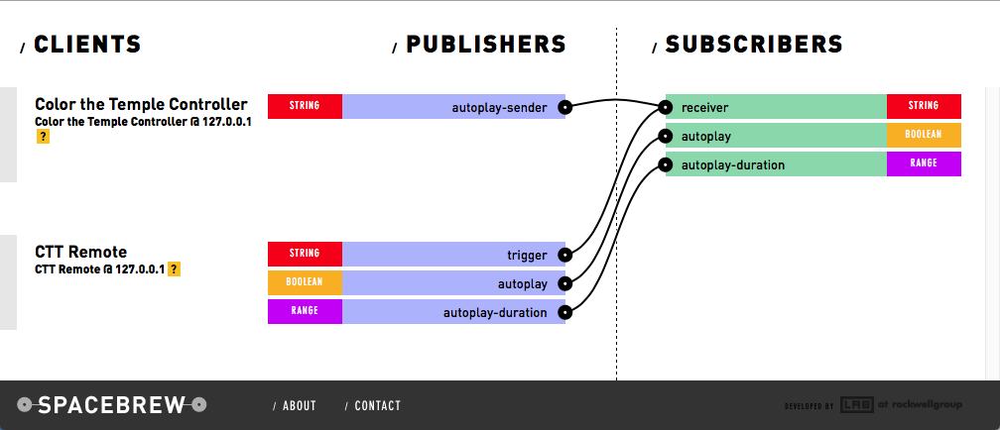

Color The Temple
================

The Color the Temple project is an interactive, projection mapped presentation about Hathor, Horus and Caesar Augustus. The content and software was initially developed by Maria Paula Saba and Matt Felsen during their internship in the Media Lab at the Metropolitan Museum of Art under the supervision of Don Undeen. They worked with Erin Peters during her fellowship at the Egyptian Art Department under the supervision of Diana Patch.

# First-time setup

Follow these steps if you are setting up a new computer from scratch. This includes setup & compilation of the main frontend C++ application, setup of the Spacebrew backend, and setup of MadMapper for calibrating projector output.

If this is already set up and you are looking for daily startup procedures, jump to the **Daily start procedures** section.


## Compile the openFrameworks presentation app

### Download openFrameworks

Download the v0.8.4 release of [openFrameworks](http://openframeworks.cc):
[http://www.openframeworks.cc/versions/v0.8.4/of_v0.8.4_osx_release.zip](http://www.openframeworks.cc/versions/v0.8.4/of_v0.8.4_osx_release.zip)

Rename the folder to `openFrameworks` and put it in your home folder. The full page should be something like `/Users/YOUR_USER_NAME/openFrameworks`

Clone this repository into `~/openFrameworks/apps`

```
cd ~/openFrameworks/apps
git clone http://github.com/metmuseum-medialab/colorthetemple
````

### Download dependencies

Clone these required addons [ofxJSON](https://github.com/jefftimesten/ofxJSON.git), - [ofxSyphon](https://github.com/astellato/ofxSyphon), [ofxSpacebrew](https://github.com/Spacebrew/ofxSpacebrew), and [ofxLibwebsockets](https://github.com/labatrockwell/ofxLibwebsockets) into `~/openFrameworks/addons`

```
cd ~/openFrameworks/addons
git clone https://github.com/jefftimesten/ofxJSON.git
git clone https://github.com/astellato/ofxSyphon
git clone https://github.com/Spacebrew/ofxSpacebrew
git clone https://github.com/labatrockwell/ofxLibwebsockets
```
    
Check out specific versions of these addons that are known to work:

```
cd ~/openFrameworks/addons
cd ofxJSON
git checkout 5934d70
cd ..

cd ofxLibwebsockets
git checkout 30a2d3c
cd ..

cd ofxSyphon
git checkout 62353d8
cd ..

cd ofxSpacebrew
git checkout d99b734
cd ..
``` 

### Build the app
Open SpacebrewController.xcodeproj in Xcode. Make sure to build the **Debug**, not the **Release** target. Add the video files to `~/openFrameworks/apps/colorthetemple/ColorTheTemple/bin/data`

## Setup Spacebrew for remote control
[note: normally you wouldn't run code right from the Downloads directory. You should probably move both the Spacebrew directory and the colorTheTemple project under a common directory, with its own openframeworks directory structure. But the below will work.

#### Install Spacebrew

**Note:** This only be needs to be done if you are setting up the project on a new computer or new account. It is already set up on the `undeed` account on the Mac mini

Download and unzip the latest release of [spacebrew](http://spacebrew.cc) to `~/Downloads`

```
cd ~/Downloads && curl https://codeload.github.com/Spacebrew/spacebrew/legacy.zip/master -o spacebrew.zip
unzip spacebrew.zip
cd spacebrew
npm install       # install libraries
```

#### Run spacebrew

**Note:** These folder paths are for the Mac mini. If the account name or folder paths are different on your computer, make sure you `cd` into the right place :)

```
cd /Users/undeed/colorTheTemple/Spacebrew
npm start
```

##### Start a web server for the Spacebrew admin page

Serve up the spacebrew admin page in another terminal and open it up in your web browser

```
cd /Users/undeed/colorTheTemple/Spacebrew/admin
python -m SimpleHTTPServer 8001
open http://localhost:8001
```

##### Start a web server for the Color the Temple admin page

Serve up the colorthetemple controller page in yet another terminal and open it up in whatever you want to control the app

```
cd /Users/undeed/colorTheTemple/openFrameworks/apps/colorthetemple/WebInterfaces/colorthetemple
python -m SimpleHTTPServer 8000
open http://localhost:8000
```

##### Start the openFrameworks app

On the Mac mini, the app is already compiled so you should be able to run SpacebrewController.app without having to re-compile it in Xcode. It should be located at:
`/Users/undeed/colorTheTemple/openFrameworks/apps/colorthetemple/ColorTheTempler/bin` 

##### Connect the applications with Spacebrew

Finally, with everything running, check the Spacebrew admin page (`http://localhost:8001` on the Mac mini) and make sure the controller (CTT Remote) is connectd to the OF app. All of the following connections should be made

To make a connection, click on the text label of one side (e.g. "trigger") and then click the text label of the thing you want to connect it to (e.g. "receiver")




## Setup MadMapper for projection mapping

Install and run [MadMapper](http://madmapper.com), after connecting to an external projector. If you are not familiar with this software, you may want to look over the [Basic Introduction](http://www.madmapper.com/basic-introduction/) guide first.

Open up MadMapper, which will be used to deform the projection. In order to calibrate the projection as described below, the openFrameworks SpacebrewController application (detailed above) must be running, and should be set so that some content is visible in the window. This can be done via web controller.

- From the Inputs tab, click the Syphon > ColorTheTemple input
- From the Surfaces tab, add a quad surface
- From the menu bar, select View > Input
	- Use the controls to ensure the quad surface fully surrounds the content with the least amount of additional space around the edges
- From the menu bar, select View > Output Preview
	- Use the four corner control points to distort the projection so that it lines up with the stone
	- It is helpful to start in one corner and work your way around until the projection lines up as best as possible. You will probably need to adjust each corner several times after adjusting other corners. After this step, the projection should be mostly aligned. Use some features near the corners to check for alignment, such as the heels of a foot, the top of a crown, etc.
	- To fine-tune smaller details such as heiroglyphs, click the "Mesh Warping" checkbox in the sidebar. Subdividing the mesh into a 16x16 grid should give enough resolution to control minute details. Drag individual mesh points as needed. You can also select points and then use the arrow keys to adjust one pixel at a time. Additional help is available in the [Grid Warping](http://www.madmapper.com/grid-warping-in-madmapper/) tutorial.
	
Once the mapping has been set up, you should save this file so that this procedure doesn't need to be performed again unless the projector is moved.


## Daily start procedures

### Terminal First Tab

Copy and paste one line by one line

Open first tab­

```
cd /Users/undeed/colorTheTemple/Spacebrew
npm start
```

### Terminal Second Tab

Copy and paste one line by one line

Open 2nd tab

```
cd /Users/undeed/colorTheTemple/Spacebrew/admin
python ­m SimpleHTTPServer 8001
```

### Terminal Third Tab

Copy and paste one line by one line

```
cd /Users/undeed/colorTheTemple/openFrameworks/apps/colorthetemple/WebInterfaces/colorthetemple
python ­m SimpleHTTPServer 8000
```

### Open Browser Windows

These are bookmarked in the Chrome bookmarks bar, or you can click here

- Spacebrew Admin [http://localhost:8001/](http://localhost:8001/)
- Color the Temple Controller [http://localhost:8000/](http://localhost:8000/)

**Make sure each web page is only opened once. Multiple copies might cause problems**

### Open SpacebrewController.app

Double click SpacebrewController.app alias on Desktop

### Go to browsers

- Go to [http://localhost:8001/](http://localhost:8001/)
- Make sure you see both “Color the Temple Controller” and “CTT Remote” in the Spacebrew admin.
	- If not, try refreshing both browser windows
- If you do not want auto play:
	- click the “Patterns” in blue in the browser

- If you want auto play mode
	- Click the Autoplay button at the top of the browser. When it is green, auto play is on. When it is red, auto play is off. To change the playback speed, set the amount of time to wait (in seconds) at each pause in the video and click the “Set duration” button.

### Open MadMapper

Double click “Color the Temple Mapping” alias on desktop

MadMapper Instructions:

- Go to output
- Choose full screen
- If the projection does not line up with the temple, see the above section about MadMapper setup to map/calibrate the projection with the carvings in the stone.

### Setting the Tablet controller


Enjoy the show!
